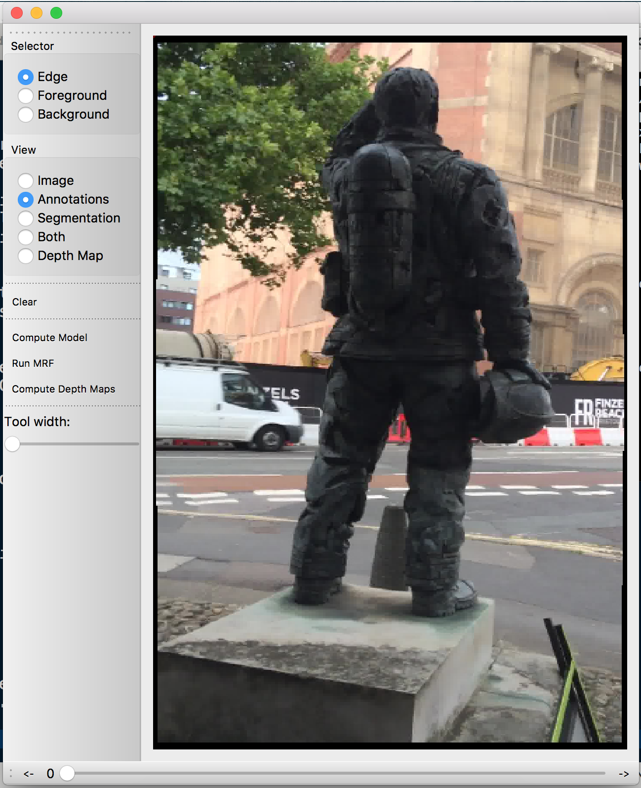
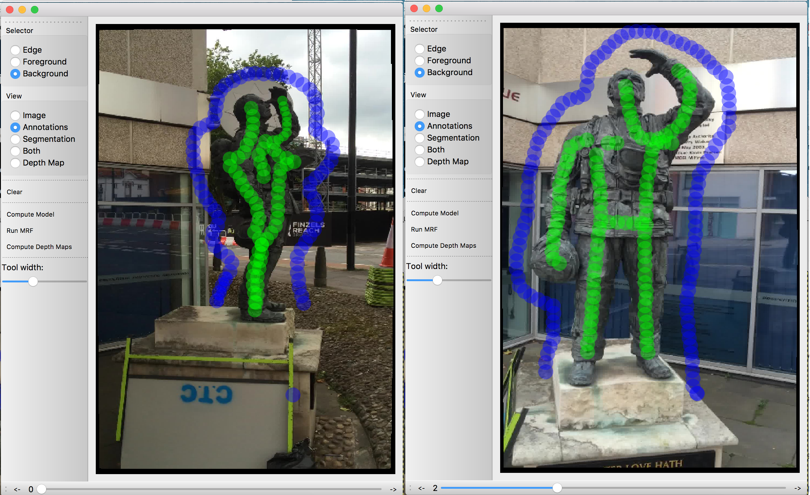
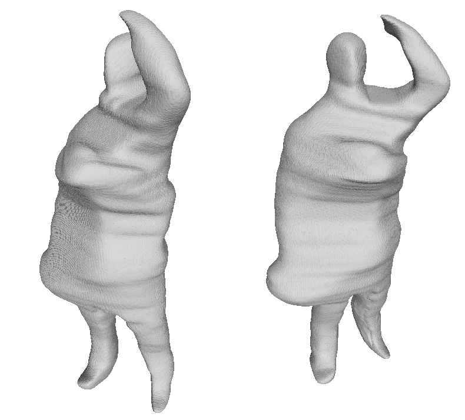
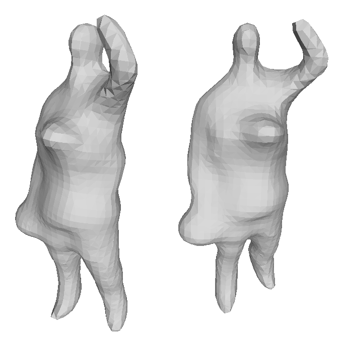

# StatueReconstruction

## Overview
The code provided in this repository was created for the 'Urban Assets' work package of the 'Outdoor Asset Capture' project at the University of Bath. The project was set up to acquire models of objects in the environment for use in computer graphics.

Given a collection of calibrated images and a 3D point cloud, one can compute object segmentations interactively using the software, and from them compute the visual hull of the object. The software requires a user to highlight the object and background in few images.

The software is a similar approach to reconstruction as used in [1], although it requires a small amount of user input, but also uses the objects depth in the segmentation model. The visual hull is computed using a probabilistic object segmentation, which leads to a smoother surface. 

[1] - "Automatic Object Segmentation from Calibrated Images" - Neil Campbell et al. In Proceedings 8th European Conference on Visual Media Production, 2011. 

## Pre-requisites

The software requires Mac OSX with Qt5 installed to compile. It also requires the Eigen library, which is included with the software.

## Installation

To compile the software either open the project file in the source directory, and compile from Qt Creator, or run,
> ./Build.sh
from the base directory.

## Examples

The code is separated in to two applications, the interactive segmentation, and the visual hull space carving. The segmentation generates the input for the space carving algorithm, which cane be run from the command line.

Inside the data folder there is an example point cloud with calibrated images, which can be used to create an example mesh, following the steps outlined below.

### The Segmentation GUI
Once the code has compiled open the GUI.app application in the build directory (build/bin/GUI.app). 

{: width=500px}

First, open the images by selecting File->open. You will see an interface like the one above. Secondly, open the ply file in File->Load Mesh, and then the cameras using File->Load Cameras.

Before interacting with the main window click on the button labelled "Compute Depth Maps" on the left hand button panel. This will compute the depths of the points in each of the views. Once this computed, you will be able to select the "Depth Map" radio button on the left hand panel to view the maps. Once you have done this drag the slider at the bottom to change the camera view and visualise the point cloud. If the point cloud was not loaded, this image will be empty.

Reselect the "Annotations" radio button in the left hand panel, and choose a pen width using the slider titled "Tool Width. It is best to have this set to about a third of the whole slider length before highlighting the image. Once this is done select the "Foreground" radio button on the left hand panel and highlight a region on the object. It is not necessary to cover every pixel, but it is better to capture the whole object. An example is given below.

Do the same thing for the background and then change views using the slider at the bottom of the interface. It is better to select views which are different in terms of colour and angle in order to maximise variances in the probability distributions. Repeat the process for the new view, as described above.

Once all of the necessary views have been annotated click on the "Compute Model" button on the left hand panel. While the models are being computed output is printed to stdout. Once the computation has completed the program will automatically switch to the "Segmentation" view mode, which can be changed using the radio buttons on the left. View all of the segmentations using the slider. 

If there are any errors which need correcting, switch back to "Annotation" mode and corectly label the pixels using the "Foreground" or "Background" tools. One can view both annotations and segmentation in the "Both" view mode. The MRFs can be recalculated quickly, without the need to estimate the models again, by clicking on the "Run MRF" button.

Finally, save the segmentations by clinking on the file menu File->Save Segmentations. A dialogue will appear asking for the directory in which to save the segmentations. The software will automatically save the segmentations images in the format 'Segmentation%.02d.png'. Some examples have been uploaded in to the data/segmentations folder.

### The space carving algorithm
Once the segmentations are saved, the space carving algorithm can be run. Before execution, one must first create two files containing paths to the segmentation and camera files. There is a script in the 'scripts' folder which automates this. To compute a mesh from the example segmentations, enter the script directory and run,
> ./GenerateTextFiles.sh ../data/segmentations/ ../data/cameras/

There will be files named Cameras.txt and Images.txt. Run,
> cat Cameras.txt Images.txt 
to make sure that they contain the full paths to the files, and that they are pointing to files which exist.

Once this is done the space carving algorithm can be run from this scripts directory as follows,
> ../build/bin/Carving Cameras.txt Images.txt ../data/Fireman.ply .

This will output two ply files. One is named Hull.ply and contains the visual hull of the input segmentations. The second file is called PCloud.ply and it is the original point cloud, cleaned, with the normals from the visual hull transferred. One can then run a Poisson reconstruction to obtain a mesh which is closer to the point cloud. The results of this process can be seen below.

{: width=500px}
{: width=500px}

